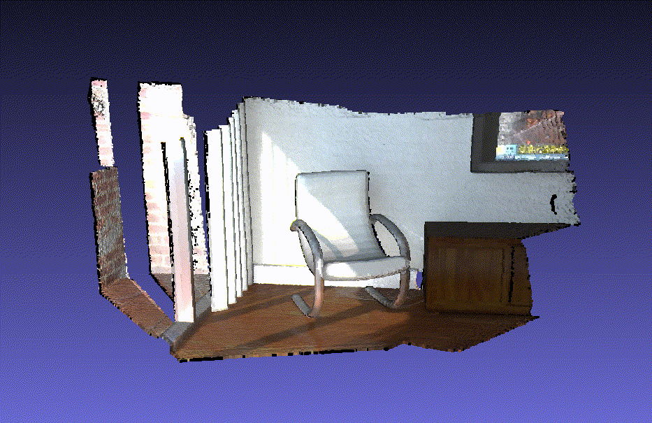

# Lab1
Implement the VoxelGrid algorithm in both AMD/NVDIA devices.  
  

## ROCm Docker
```
docker pull rocm/dev-ubuntu-22.04
docker run --device /dev/kfd --device /dev/dri -it rocm/dev-ubuntu-22.04
```

## Run
```
hipcc VoxelGrid.hip -o VoxelGrid.o
./VoxelGrid.o vertex.txt
```
